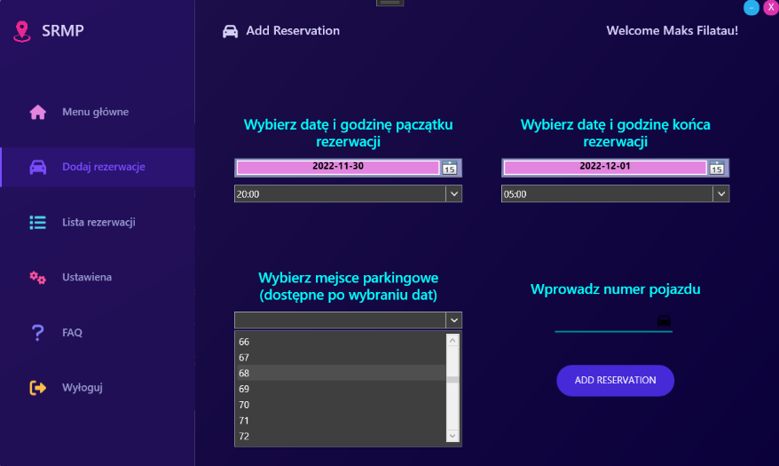
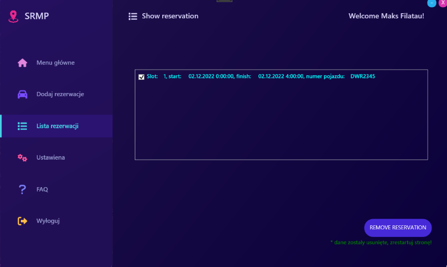

# 🚗 Parking Reservation App

A desktop application built with **C# (.NET, WPF)** that allows users to register, log in, and reserve parking spaces.  
The app provides a modern user interface, secure authentication, and a simple workflow for managing parking reservations.  

---

## ✨ Features
- 👤 **User Accounts**  
  - Registration & Login  
  - Secure password handling with custom password box  

- 🅿️ **Parking Reservation**  
  - Browse available parking spots  
  - Reserve and manage bookings  
  - View active and past reservations  

- 🎨 **Modern WPF UI**  
  - Custom styles and icons  
  - Responsive layout with images  

- 🧩 **Architecture**  
  - MVVM pattern (Model, Repository, View, ViewModel separation)  
  - Modular code for scalability  

---

## 📂 Project Structure
```
Parking-Reservation-App-master/
│── Uslugi_application_user.sln        # Visual Studio solution
│── Uslugi_application_user/           # Main project
│   ├── App.xaml                       # WPF entry point
│   ├── Models/                        # Data models (Parking, User, Accounts)
│   ├── Repositories/                  # Data repositories
│   ├── CustomsControls/               # Custom WPF controls
│   ├── Styles/                        # XAML styles
│   ├── Images/                        # Icons & backgrounds
│   └── Properties/                    # Settings and metadata
```

---

## ⚙️ Requirements
- **.NET Framework 4.7.2+** (or .NET 5/6 if migrated)  
- **Visual Studio 2019/2022** with WPF workload  

---

## 🔧 Build & Run
1. Open solution:
   ```bash
   Uslugi_application_user.sln
   ```
   in Visual Studio.  

2. Restore NuGet packages:
   ```bash
   dotnet restore
   ```

3. Build and run:
   ```bash
   dotnet build
   dotnet run
   ```

---

## 🖼️ Screenshots
<p align="center">
  
  
</p>

---

## 🛠️ Development
- Language: **C#**  
- Framework: **.NET / WPF**  
- Pattern: **MVVM**
- Database: **MySQL**

---
